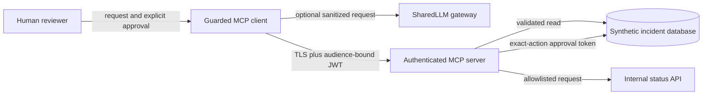

# Threat Model

## Scope and assets

The system is an MCP client and a Streamable HTTP MCP server operating on synthetic incident data. Protected assets are the MCP signing secret, approval signing secret, access tokens, incident records, service-status data, audit identity, and tool integrity. SharedLLM is optional and receives only the sanitized user request; it never receives MCP or approval tokens.

## Trust boundaries and data flow

1. Untrusted natural-language input crosses into the client. The client normalizes it, enforces length/control-character limits, and rejects injection patterns.
2. Tool metadata crosses from server to client. The client accepts only an exact tool allowlist and rejects suspicious descriptions.
3. The client crosses the network boundary with a short-lived signed JWT. The server validates signature, issuer, audience, expiry, and scopes.
4. Read tools access only synthetic data and allowlisted service names.
5. A write crosses a separate human-approval boundary. The approval token is short-lived, single-use, and bound to the tool and exact arguments.

## Risks and mitigations

| Risk | Attack | Mitigations implemented |
|---|---|---|
| Prompt injection | A request says to ignore rules, reveal prompts, or bypass approval. | Unicode normalization, maximum length, control-character rejection, injection-pattern blocklist, and strict routing schemas. Authorization remains outside the model. |
| Tool poisoning | A compromised server advertises an extra tool or malicious description. | Exact client-side tool allowlist, duplicate/missing tool detection, and suspicious-description scan before every invocation session. |
| Unauthorized MCP access | An attacker connects without a token, reuses an expired token, or sends a token for another service. | HS256 signature validation, short expiry, issuer and audience checks, mandatory `mcp:access`, and per-tool scopes. Production should replace HMAC with IdP-issued asymmetric tokens. |
| Destructive action without consent | A model or attacker calls `update_incident_status` directly. | Required `incidents:write` scope plus a separate signed approval token bound to the exact arguments, short expiry, and one-time nonce. The client displays the action and requires the human to type `yes`. |
| Token or secret leakage | Credentials appear in Git, logs, prompts, or SharedLLM traffic. | `.env` is ignored; `.env.example` contains placeholders; results never return secrets; SharedLLM receives no tokens; README includes a pre-submission secret scan. |
| Replay or argument substitution | An approved action is reused or changed after approval. | SHA-256 digest binds tool name and canonical arguments; nonce is consumed once. A production system would store nonces in a durable shared cache. |
| Internal API abuse | User-controlled service names become SSRF targets. | `get_service_status` accepts only three literal service identifiers and never accepts a URL. |

## Residual risk and production improvements

This is a reproducible course demonstration, not a production identity provider. A production deployment should use HTTPS, an OAuth 2.1/OIDC provider with asymmetric keys and rotation, durable centralized nonce storage, structured audit logs, rate limits, egress policy, dependency scanning, and separate approval-service credentials. The local client contains the approval secret only to simulate that external service; the threat boundary is documented rather than hidden.

